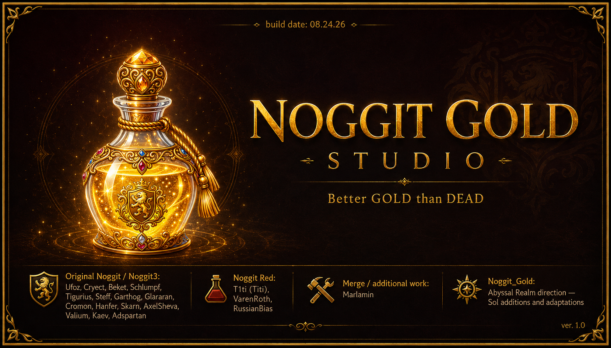

# Noggit_Gold

**Noggit_Gold** is a WotLK 3.3.5 map-authoring continuation built from the merged Noggit Red production source, with selected useful behavior adapted from earlier Noggit branches while preserving Red/Gold's newer architecture.

This repository is being opened for **public testing**. The goal is not to claim every editor path is finished; it is to get the current working WotLK tool into more hands so terrain, texture, liquid, lighting, chunk, object, and persistence edge cases can be tested across many real maps and systems.

## Public Test Status

### Live-proven in the current Gold baseline

- Eraser / Clear Tool across the tested clear categories.
- Eraser undo/redo through Noggit's existing ActionManager path.
- Chunk Mover copy/paste.
- Chunk Mover quarter-turn rotation, including tested 90-degree and 180-degree placements.
- Water Tool cursor intersection with the visible liquid surface.
- Persistent Saved Chunks core behavior.
- Saved multi-chunk sections carrying associated objects/assets in tested cases.
- Saved-section quarter-turn rotation and paste.
- Light Editor **Port to Light** navigation for selected local lights.
- Selected-light identification using the existing Draw Current Only / wireframe path.
- Auto Texture PASS1 single-ADT application.
- Auto Texture terrain-aware elevation/slope distribution.
- Auto Texture cliff texturing on steep terrain.
- Auto Texture undo/redo as one normal ActionManager transaction.
- Auto Texture PASS1B selected-terrain Min / Max / Span feedback and Fit Heights workflow.
- Auto Texture Base / Low Ground / High Ground / Cliff slot selection through the existing Texture Browser.

### Current public-test focus

The current source includes **Auto Texture PASS1B** UI/feedback work:

- selected terrain minimum / maximum / span display;
- Low/High height-band intersection feedback;
- Fit Heights helper;
- tighter vertical layout for narrow dock widths;
- Base / Low Ground / High Ground / Cliff texture slots;
- clicking a texture preview/name opens the existing Noggit Texture Browser for that slot;
- `Use Current` remains available as a shortcut.

The four-slot Texture Browser selection path has been **live-tested successfully**. Public testing should now concentrate on adjacent-ADT seams, wider 3–8 ADT use, save/reload and in-game appearance, Light DBC write persistence, and general regression across different machines and maps.

## Important Auto Texture Safety Boundary

PASS1 is deliberately conservative:

- only explicitly selected ADTs are processed;
- selected ADTs must already be loaded;
- unloaded selected ADTs cause the operation to refuse rather than partially write;
- maximum 8 selected ADTs per Apply;
- no implicit Entire Map mode;
- Auto Texture replaces the existing four-layer terrain palette on the selected ADTs;
- Apply is captured through the existing ActionManager undo/redo system.

Back up important map work before testing any editor build.

See **[PUBLIC_TESTING.md](PUBLIC_TESTING.md)** for the exact test checklist and bug-report format.

## Known Unproven / Incomplete Areas

- Adjacent-ADT Auto Texture seam behavior needs broader proof.
- Full in-game client appearance after save/reload still needs broader proof across maps.
- Light Editor DBC write -> full restart -> persistence lifecycle is not yet public/live-proven and should only be tested against disposable/backed-up DBC copies.
- Light Editor float-curve editing, deep independent light duplication, Delete Light, and Save Name are not considered finished production paths.

## Building

This project uses CMake and Qt5. On Windows, the existing Noggit build expects the usual Noggit dependencies such as OpenGL, StormLib, CascLib, Qt5, and Lua. Some dependencies may be obtained through FetchContent depending on your environment.

Typical Windows flow:

1. Install a compatible Visual Studio C++ toolchain and Qt5.
2. Configure the project with CMake.
3. Set the Qt prefix/path as required by your local install.
4. Generate the Visual Studio solution.
5. Build the desired target in Visual Studio.
6. Ensure the required Qt runtime DLLs are available beside the executable or otherwise discoverable.

The inherited build files and comments remain the authority for platform-specific details; public testers are encouraged to report clean-build issues with exact compiler/CMake/Qt versions.

## Reporting Bugs

Please use GitHub Issues and include:

- exact Noggit_Gold build/commit;
- Windows/Linux version;
- GPU and driver if the issue is graphical;
- map and ADT coordinates;
- exact tool and steps;
- whether undo/redo was involved;
- whether the ADT was saved/reloaded;
- whether the result was also checked in the WoW client;
- screenshots or a short video when useful;
- crash log/stack trace when available.

Do **not** upload proprietary Blizzard game data to this repository when reporting a bug.

## Project Lineage and Credits

Noggit_Gold is **not** presented as a from-scratch editor. It continues an existing Noggit lineage and preserves the inherited source history, licenses, notices, and contributor work contained in this tree.

The retained project lineage includes:

- original **Noggit / Noggit3** contributors;
- the **Noggit Red** family of forks/work, including Titi/T1ti, VarenRoth, RussianBias, and merge/additional work associated with Marlamin where represented by the inherited source/history;
- selected behavior adapted from **Noggit Green** into the Red/Gold production architecture;
- **Noggit_Gold** additions and adaptations developed for the Abyssal Realm toolchain.

Before any final stable/public release, contributor/provenance details should be audited once more against the exact published Git history rather than relying on a short README summary.

## License

The inherited project is distributed under **GNU GPL v3**. See [`COPYING`](COPYING).

Keep applicable license notices, copyright statements, upstream attribution, and source availability intact when redistributing modified builds.

## Game Data

Noggit_Gold is an editor. This repository should not bundle proprietary Blizzard game data. Testers are responsible for providing their own compatible game data.
